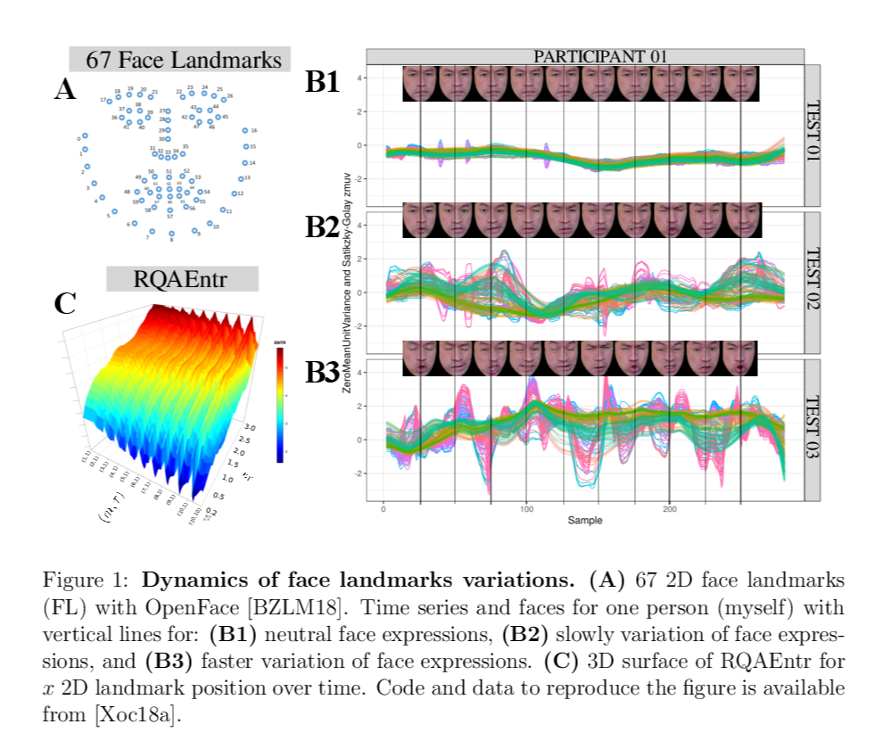

Quantifying Complexity of Facial Expressions Variability with Nonlinear Dynamics in Human-Humanoid Interaction
---
Miguel Xochicale  
21th December 2018   

> This research proposal aims to investigate the use of a method from nonlinear dynamics 
(RQAEnt) to quantify the complexity of face expressions variability and 
its relationship with mental states (e.g. anxiety, disinterest, relief)
in the context of human-humanoid interaction. 
The proposal contains two research questions,
an introduction to RQAEnt, and a pilot experiment with preliminary results.

[pdf](docs/main.pdf) [tex](docs/main.tex)

Contact
-------

If you have specific questions about the repository, you can contact
[Miguel Xochicale](mailto:perez.xochicaleATgmail.com?subject="[ofNoDYN]"). 
If your question might be relevant to other people, please instead [open an
issue](https://github.com/mxochicale/complexity-of-facial-expressions/issues).

